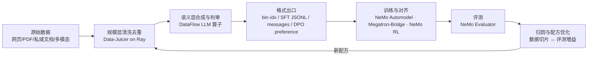

# DataFoundry（暂定名）：NeMo × Data-Juicer × DataFlow 整合产品思考

> 一句话结论：这三个项目分别是大模型数据链路的「肌肉、大脑、回报函数」，三者都没有独立闭环。
> 有价值的产品不是「第四个数据处理框架」，而是骑在三者之上的**闭环编排层**——
> 以 Ray 为统一执行底座、以「数据配方 + 效果归因」为核心资产、由 Agent 驱动的
> **数据-模型协同精炼平台**。

本仓库是一份产品思考文档集，基于对三个项目 2025–2026 年最新状态的调研写成。

## 三个项目各是什么（一屏版）

| | NVIDIA NeMo | Data-Juicer（阿里通义） | DataFlow（北大 OpenDCAI） |
|---|---|---|---|
| 定位 | 端到端训练/对齐/评测框架族（~28 个仓库） | 大模型数据处理操作系统，230 个算子 | LLM 驱动的数据准备与合成系统，~197 个算子 |
| 强项 | 训练闭环：Megatron 预训练、SFT、RL（GRPO/DAPO）、Evaluator；Curator 的 GPU 加速去重 | 规模：Ray 原生，70B 样本 2 小时级处理；多模态（视频/音频/图像）一等公民 | 语义：LLM 合成/判审/改写；推理数据、Text2SQL、知识库清洗等领域流水线；NL→Pipeline Agent |
| 短板 | CUDA 锁定、API 快速变动、无数据血缘、微服务层闭源 | LLM 语义算子薄、合成是单调用级、训练侧只有文件交接 | 单机 pandas、分布式雏形、多模态薄、LLM 调用成本高 |
| 许可 | 开源部分 Apache-2.0，NIM/微服务闭源 | Apache-2.0（~6.9k stars） | Apache-2.0（~7.3k stars） |

**互补关系**：Data-Juicer 有吞吐没语义深度；DataFlow 有语义没吞吐；NeMo 有训练与评测（数据好坏的最终裁判）但数据工具锁在 NVIDIA 栈里、且不管配方与血缘。三者叠起来正好是一条完整的数据精炼产线——但今天没有人把这条产线接通。

## 产品核心：把「开环」接成「闭环」

今天这条链路上每个箭头都是断的：靠人肉导文件、写胶水脚本。DJ 的 Sandbox（ICML'25 Spotlight）已经在小范围验证了「Probe–Analyze–Refine」闭环能涨点（VBench 登顶、图文任务 +7%），产品要做的就是把这个闭环工业化到全栈。

## 为什么是现在（时间窗口）

1. **Ray 收敛**：NeMo Curator 已从 Dask 全面迁移到 Ray（Xenna 执行器）、Data-Juicer 原生 Ray、NeMo RL 用 Ray 编排、DataFlow 有实验性 rayorch。2024 年做这个整合要跨三种执行引擎，2026 年只剩一种——统一底座的工程成本降了一个量级。
2. **双方都已暴露 MCP 接口**：Data-Juicer 与 DataFlow 都已内置 MCP Server，算子可被 Agent 直接调用；DataFlow-Harness 用 Claude Code 类编码代理做 NL→Pipeline 已跑到 93.3% 通过率。Agent 驱动的数据工程从论文变成了可复用的工程件。
3. **后训练数据成为主要瓶颈**：推理数据、RL 环境数据、私域 SFT 数据的合成与筛选是当前所有非头部团队的共同痛点，人工标注经济模型正在失效。
4. **窗口有限（12–18 个月）**：DJ 在补 LLM 算子、DataFlow 在补 Ray、NVIDIA 在扩微服务——三方都在向对方腹地扩张，闭环编排位今天还是空的，之后未必。

## 先泼一盆冷水：什么时候**不该**做这个整合

- 只是自己团队偶尔清洗数据：小规模直接用 DataFlow 单机，大规模文本/多模态用 Data-Juicer，NVIDIA 栈训练就用 Curator——按需选用即可，不值得为一次性需求做平台。
- 想再造一个「大一统算子框架」：这是 XKCD 927（第 15 个标准）路线，两边社区都不会跟你走。
- 整合的价值**只**成立于：你要反复走完整闭环（做模型的团队），或你要把这条产线做成产品卖给别人（做平台的团队）。

## 文档目录

| 文档 | 内容 |
|---|---|
| [docs/01-三大项目解析.md](docs/01-三大项目解析.md) | 三个项目的架构、能力边界、2025–26 关键变化与短板（调研事实层） |
| [docs/02-产品方案.md](docs/02-产品方案.md) | 产品定位、目标用户、系统架构、五个技术楔子、竞品与商业模式（方案层） |
| [docs/03-路线图与风险.md](docs/03-路线图与风险.md) | 90 天 MVP、6/12 个月里程碑、风险对策、成功指标、留给你决策的开放问题 |

---

*本文档集由调研整理而成，事实性内容（版本、算子数、性能数字、社区数据）截至 2026-08，来源见各文档尾注。*
