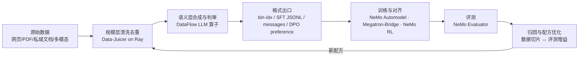

# DataFoundry（暂定名）：数据精炼平台

> 定位：**生产高质量训练数据的平台**。核心自研（配方表达、漏斗编译、血缘、鉴权、MCP harness），
> **闭源组件零依赖**；开源项目（Data-Juicer / DataFlow / NeMo 开源仓库，均 Apache-2.0）作为
> 可插拔引擎接入。平台本身是 **Claude Code 可驱动的 harness**——Agent 的能力严格等于其
> API Key 对应用户的角色。

本仓库包含：`datafoundry/` 平台代码（v0.1，57 例测试全绿）+ `docs/` 产品思考文档集。

## 平台 v0.1 快速上手

```bash
pip install -e .            # 零依赖内核+CLI(拆包 v0.2:服务端加 '.[server]')
datafoundry demo          # 离线演示:脏数据 -> 漏斗流水线 -> 留存/死因报告

datafoundry recipes       # 命名配方:简单算子的组合,每个带实验证据出处
datafoundry refine --recipe math_zh_funnel_v1 --in data.jsonl   # 一条命令精炼:估成本->漏斗执行->报告
datafoundry audit --run <运行目录> --standard tc260   # 合规证据包:TC260/EU-AI-Act 口径审计报告

datafoundry serve         # 起 HTTP API(需 pip install -e '.[server]')(默认 127.0.0.1:8321)
# 首次: POST /auth/bootstrap 创建 admin(或 datafoundry create-user)

datafoundry login         # 设备授权登录(RFC 8628,同 feishu-cli/TapTap 模式):
                          # 打印验证链接+授权码 -> 任意浏览器确认 -> 凭据存 ~/.datafoundry(0600)
datafoundry login --no-wait --json   # Agent 两段式:先拿 device_code,--device-code 续轮询
datafoundry whoami && datafoundry logout   # 查身份 / 吊销 Key 并清凭据

# 接入 Claude Code(9 个 MCP 工具:传数据/查算子/查配方/估成本/跑流水线/看死因):
claude mcp add datafoundry \
  --env DATAFOUNDRY_URL=http://127.0.0.1:8321 \
  --env DATAFOUNDRY_API_KEY=dfk_xxx \
  -- datafoundry mcp
```

已实现：自研算子引擎（过滤/改写/去重/验证/LLM 判审）、**命名配方**（简单算子的组合即可售卖单元，CLI/API/MCP 三面可用，每个配方携带实验证据）、**漏斗编译器**（贵算子自动后置，演示场景省 46% 成本）、
**逐样本血缘**（rejects 带死因，即审计凭证）、**RBAC 鉴权**（argon2-cffi + PyJWT 开源组件，三角色 + API Key + 审计日志）、
Data-Juicer 开源引擎薄适配（可选安装）。详见 [docs/05-平台v0.1架构.md](docs/05-平台v0.1架构.md)。

---

## 背景：三个项目的调研与产品思考

> 一句话结论：NeMo、Data-Juicer、DataFlow 分别是大模型数据链路的「回报函数、肌肉、大脑」，
> 三者都没有独立闭环。平台的价值在闭环编排层：以「数据配方 + 效果归因」为核心资产、由 Agent 驱动的
> **数据-模型协同精炼平台**。以下文档基于对三个项目 2025–2026 年最新状态的调研写成。

## 三个项目各是什么（一屏版）

| | NVIDIA NeMo | Data-Juicer（阿里通义） | DataFlow（北大 OpenDCAI） |
|---|---|---|---|
| 定位 | 端到端训练/对齐/评测框架族（~28 个仓库） | 大模型数据处理操作系统，230 个算子 | LLM 驱动的数据准备与合成系统，~197 个算子 |
| 强项 | 训练闭环：Megatron 预训练、SFT、RL（GRPO/DAPO）、Evaluator；Curator 的 GPU 加速去重 | 规模：Ray 原生，70B 样本 2 小时级处理；多模态（视频/音频/图像）一等公民 | 语义：LLM 合成/判审/改写；推理数据、Text2SQL、知识库清洗等领域流水线；NL→Pipeline Agent |
| 短板 | CUDA 锁定、API 快速变动、无数据血缘、微服务层闭源 | LLM 语义算子薄、合成是单调用级、训练侧只有文件交接 | 单机 pandas、分布式雏形、多模态薄、LLM 调用成本高 |
| 许可 | 开源部分 Apache-2.0，NIM/微服务闭源 | Apache-2.0（~6.9k stars） | Apache-2.0（~7.3k stars） |

**互补关系**：Data-Juicer 有吞吐没语义深度；DataFlow 有语义没吞吐；NeMo 有训练与评测（数据好坏的最终裁判）但数据工具锁在 NVIDIA 栈里、且不管配方与血缘。三者叠起来正好是一条完整的数据精炼产线——但今天没有人把这条产线接通。

## 产品核心：把「开环」接成「闭环」



今天这条链路上每个箭头都是断的：靠人肉导文件、写胶水脚本。DJ 的 Sandbox（ICML'25 Spotlight）已经在小范围验证了「Probe–Analyze–Refine」闭环能涨点（VBench 登顶、图文任务 +7%），产品要做的就是把这个闭环工业化到全栈。

## 为什么是现在（时间窗口）

1. **Ray 收敛**：NeMo Curator 已从 Dask 全面迁移到 Ray（Xenna 执行器）、Data-Juicer 原生 Ray、NeMo RL 用 Ray 编排、DataFlow 有实验性 rayorch。2024 年做这个整合要跨三种执行引擎，2026 年只剩一种——统一底座的工程成本降了一个量级。
2. **双方都已暴露 MCP 接口**：Data-Juicer 与 DataFlow 都已内置 MCP Server，算子可被 Agent 直接调用；DataFlow-Harness 用 Claude Code 类编码代理做 NL→Pipeline 已跑到 93.3% 通过率。Agent 驱动的数据工程从论文变成了可复用的工程件。
3. **后训练数据成为主要瓶颈**：推理数据、RL 环境数据、私域 SFT 数据的合成与筛选是当前所有非头部团队的共同痛点，人工标注经济模型正在失效。
4. **窗口有限（12–18 个月）**：DJ 在补 LLM 算子、DataFlow 在补 Ray、NVIDIA 在扩微服务——三方都在向对方腹地扩张，闭环编排位今天还是空的，之后未必。

## 先泼一盆冷水：什么时候**不该**做这个整合

- 只是自己团队偶尔清洗数据：小规模直接用 DataFlow 单机，大规模文本/多模态用 Data-Juicer，NVIDIA 栈训练就用 Curator——按需选用即可，不值得为一次性需求做平台。
- 想再造一个「大一统算子框架」：这是 XKCD 927（第 15 个标准）路线，两边社区都不会跟你走。
- 整合的价值**只**成立于：你要反复走完整闭环（做模型的团队），或你要把这条产线做成产品卖给别人（做平台的团队）。

## 文档目录

| 文档 | 内容 |
|---|---|
| [docs/01-三大项目解析.md](docs/01-三大项目解析.md) | 三个项目的架构、能力边界、2025–26 关键变化与短板（调研事实层） |
| [docs/02-产品方案.md](docs/02-产品方案.md) | 产品定位、目标用户、系统架构、五个技术楔子、竞品与商业模式（方案层，按「卖平台」形态设计） |
| [docs/03-路线图与风险.md](docs/03-路线图与风险.md) | 90 天 MVP、6/12 个月里程碑、风险对策、成功指标、留给你决策的开放问题 |
| [docs/04-质量从哪来与依赖边界.md](docs/04-质量从哪来与依赖边界.md) | **追问与修正**：质量的生产函数（源×变换×判别×验证×反馈）；依赖红线 v2——**闭源零依赖，开源可依赖但薄适配**、配方表达自持 |
| [docs/05-平台v0.1架构.md](docs/05-平台v0.1架构.md) | **平台实现**：自研架构、漏斗编译器、血缘、开源鉴权组件（argon2+JWT+RBAC）、Claude Code MCP 接入、v0.1 边界与下一步 |
| [docs/06-CLI登录流程调研与实现.md](docs/06-CLI登录流程调研与实现.md) | **CLI 登录**：feishu-cli / TapTap 登录流程调研（设备授权流 RFC 8628），DataFoundry `login/whoami/logout` 实现与烟测记录 |
| [docs/07-五分钟试驾.md](docs/07-五分钟试驾.md) | **试驾指南**：从克隆到登录到跑流水线的完整实测步骤（已在干净环境验证） |
| [docs/08-项目管理与事项拆解.md](docs/08-项目管理与事项拆解.md) | **项目管理**：M1–M3 三级 WBS、验收标准、硬门禁与转向预案；M1 事项已建为 [GitHub Issues](https://github.com/William2333ZZ/claude_repo/issues)（#8 为总览看板） |
| [docs/09-团队分工与角色.md](docs/09-团队分工与角色.md) | **团队分工**：产品统领制（产品为项目全权负责，商业化并入产品域）+ 算法/平台执行域 + AI 执行单元；每事项 Owner×Exec 归属、域间接口、1→5 人的帽子分配 |
| [docs/10-商业化外壳选型与TinyShip结合.md](docs/10-商业化外壳选型与TinyShip结合.md) | **商业外壳**：TinyShip/ShipFast 分析、两仓分离架构（私有外壳↔开源内核）、Steph Ango 定价叙事；架构深读与 gate 后购入的决策记录 |
| [docs/11-支付与计费接入.md](docs/11-支付与计费接入.md) | **支付计费**：额度/订单/账本模型，支付宝当面付（主）/Stripe/微信三通道，收银台在外壳、账本在内核的边界 |
| [docs/12-节点验收与评审报告.md](docs/12-节点验收与评审报告.md) | **节点评审**：技术架构逐层验收、产品矩阵成熟度、全节点判定表；P0 发现（账本易失存储）与 gate 后首批事项裁定 |
| [docs/13-技术选型决策记录.md](docs/13-技术选型决策记录.md) | **技术选型**：全项目 ADR 汇总——每项选择的理由、落选备选、重估触发条件；前端选型（内核零框架/外壳 Next.js）与选型纪律 |
| [docs/14-商业化方案.md](docs/14-商业化方案.md) | **商业化**（产品域全权）：可售卖物清单、客户分层与购买旅程、定价与打包 v1、单位经济、收入里程碑、红线与开放问题 |
| [docs/15-使用场景与保真阶梯.md](docs/15-使用场景与保真阶梯.md) | **产品设计方法论**：四张客户场景卡 × 低/中/高三级保真、现状诚实矩阵、双轨推进规则（场景轨与技术轨并行）、S1 访谈一页纸 |
| [docs/16-需求证据与分析.md](docs/16-需求证据与分析.md) | **需求证据**：互联网侧低保真验证——三假设判定（痛点✅/合规血缘✅✅/付费品类🟡）、十条分级证据、需求→工程 backlog 映射、对定价与叙事的影响 |
| [docs/17-价值与可行性评审.md](docs/17-价值与可行性评审.md) | **价值×可行评审**：12 事项四象限裁定、论点级评审（配方已实/归因零验证）、明确不做清单、资源报备三项（LLM/GPU/支付宝提审） |
| [docs/18-架构总览.md](docs/18-架构总览.md) | **架构总览**：产品架构（客户旅程漏斗×产品形态）、技术架构 as-built、部署与跳板拓扑、数据闭环四张图 + 模块↔代码↔实证对照表 |
| [docs/19-同构对标LangAlpha.md](docs/19-同构对标LangAlpha.md) | **同构对标**：LangAlpha（"Claude Code for Financial Market"）的架构/开源切法/BYOK/交付形态提取，六项采纳决策（BYOK 卖点、私有化交付一等化、复利叙事等） |
| [docs/20-C2复现报告.md](docs/20-C2复现报告.md) | **M1-C2 公开复现报告（gate 判定文书）**：证据等级声明、四种子/LLM 双种子/3B 复验全数据、死因杀伤率机制、第三方复现指引（sha256+运行 ID）、gate「通过，限定主张」 |
| [docs/21-目标架构v2.md](docs/21-目标架构v2.md) | **目标架构 v2（AI 原生）**：主链「意图→配方提案→授权→精炼事实」、五层结构 as-built 映射、安全线（判审只建议/验证器裁决）、R↔M 演进、对 BMS 架构的采纳/改造/拒绝；视觉版 [assets/arch/datafoundry-arch-v2.html](assets/arch/datafoundry-arch-v2.html) |

---

*本文档集由调研整理而成，事实性内容（版本、算子数、性能数字、社区数据）截至 2026-08，来源见各文档尾注。*
