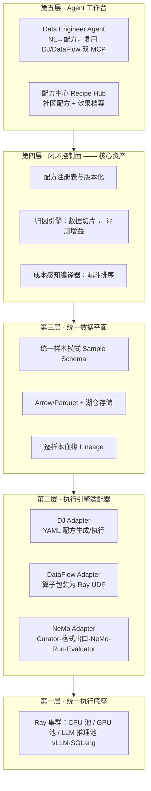

# 02 · 产品方案：数据-模型协同精炼平台

## 1. 定位：做「第四层」，不做「第四个框架」

再造一个算子框架没有出路——DJ 有 230 个算子、DataFlow 有 197 个，你写不过两个全职学术+工业团队，社区也不需要第三套算子。真正空着的位置是它们**头顶的一层**：

> **DataFoundry：面向基础模型团队的数据精炼与反馈操作系统。**
> 向下把 Data-Juicer（规模）、DataFlow（语义）、NeMo（训练/评测）当作可调度的执行引擎；
> 向上给用户一个以「配方」为中心的闭环工作台：
> 描述数据目标 → 自动编排混合流水线 → 训练评测 → 归因回流 → 配方进化。

类比：Kubernetes 之于容器运行时、dbt 之于 SQL 引擎、Terraform 之于云 API——**编排层吃掉价值，执行层保持中立**。

## 2. 目标用户（按优先级）

1. **垂直模型团队**（金融/法律/医疗/制造，10–100 人）：有私域数据、有 GPU 预算、没有数据基建团队。痛点：从「一堆 PDF 和业务库」到「能训练的高质量 SFT/RL 数据」之间没有产品，全靠手搓脚本。**付费意愿最强，是设计锚点。**
2. **开源模型微调者/AI 应用公司**：要复现「推理数据涨点」但拼不起工程。要的是现成配方 + 一键闭环。
3. **数据服务商**：从卖人力标注转向卖「数据精炼产线」，需要白标平台。
4. （远期）**云厂商**：作为托管服务集成进 PAI/火山方舟类平台——DJ 已在 PAI 里,这条通路被验证过。

**明确不做**：头部实验室（他们自建且视数据管线为核心机密）；纯数据标注工具（Label Studio 的地盘）。

## 3. 系统架构：五层



- **护城河在第四层**（闭环控制面）与第五层的配方中心；第二、三层是苦活但可被复用的开源基建；第一层直接站在 Ray 上。
- 三个上游项目**一个都不 fork**：DJ 走它的 YAML/REST/MCP 接口，DataFlow 的算子被包成 Ray `map_batches` UDF（它的 Operator 是普通 Python 类，天然可包），NeMo 走 Curator API + 格式导出 + NeMo-Run 提交。

## 4. 五个技术楔子（整合的具体抓手）

### 楔子 1：统一样本模式 + 逐样本血缘

三方 schema 各说各话：DJ 用 `text/images/videos` 约定键，DataFlow 靠 `compile()` 键匹配任意列，NeMo 要 `input/output`、`messages`、preference 三套格式。定义一个带命名空间的统一样本模式（Arrow 表示），每条样本携带：

```
sample_id · 源指纹 · 模态载荷 · 统计特征(DJ Analyzer 产出)
· 语义标注(DataFlow judge 产出) · op_trace: [哪个算子在哪个版本用什么参数动过/杀过它]
```

`op_trace` 是全平台最重要的一列——没有它，第 4 层的归因引擎无从谈起。这直接补上三方共同的空白（NeMo Data Store 只是文件桶，DJ/DataFlow 都无血缘）。

### 楔子 2：Ray 统一底座（时间窗口的核心）

2026 年的现实：DJ 原生 Ray、NeMo Curator 26.02 全面 Ray 化（Xenna）、NeMo RL 用 Ray、DataFlow 有 rayorch 雏形。**整合层可以只面向一种执行引擎编程**：

- DJ 算子：原生跑
- Curator 去重：原生跑（同一集群的 GPU 池）
- DataFlow 算子：包装为 Ray Data `map_batches` UDF，vLLM/SGLang 推理算子路由到 LLM 推理池——顺手把 DataFlow 最大的短板（单机）补掉，这也是最该**回馈上游**的贡献（给 OpenDCAI 提 rayorch 强化 PR，换社区好感与影响力）

### 楔子 3：成本感知的漏斗编译器（经济学即产品）

数据算子的成本天然分三档：

| 档位 | 例子 | 量级成本 |
|---|---|---|
| 启发式/统计（CPU） | 语言识别、长度/比率过滤、MinHash | ~分/GB |
| 小模型打分（GPU） | FineWeb-Edu、QuRating、NSFW 分类器 | ~元/GB |
| LLM 判审/合成（API 或大模型推理） | LLM-judge、CoT 合成、多跳 QA | ~元/千样本 |

朴素串联会让 LLM 算子看到全量数据，成本爆炸。编译器的职责：给定配方 DAG，**按「单位样本成本 × 预期淘汰率」自动重排**——便宜的先杀掉 90%，昂贵的只看幸存者；对 LLM 算子自动做批量、缓存、蒸馏建议（「这个 judge 已标注 50 万样本，可训一个 0.5B 打分器替代，预计省 94% 成本」）。DJ 和 DataFlow 都没做跨框架成本编排——**这是纯增量价值，也是客户最能直接感知的卖点（省钱）**。

### 楔子 4：训练-评测回路（NeMo 作为「回报函数」）

- **出口**：一键把精炼结果导出为 NeMo 四种格式（bin/idx、SFT JSONL、OpenAI messages、DPO preference），顺带支持 LLaMA-Factory/HF TRL 格式以保持训练器中立。
- **提交**：经 NeMo-Run 把微调/RL 任务发到 Slurm/K8s;经 NeMo Evaluator（或 One-Eval/自建基准）拿回评测。
- **归因**：把「配方版本 → 数据切片 → 评测增益」三元组落库。方法上从粗到细：消融（切片剔除重训小代理模型，即 DJ Sandbox 的 Probe 思路工业化）→ influence function 近似 → DataFlex 式训练时动态选数（远期内循环）。
- 每一次客户运行都在给平台积累「什么数据在什么任务上有效」的证据库——**数据网络效应，真正的长期护城河**。

### 楔子 5：Agent 工作台（入口体验）

DataFlow-Harness 已证明：MCP + Skills + 编码代理能以 93.3% 通过率从自然语言生成流水线;DJ 也有 MCP 与 InteRecipe。产品要做的不是自研规划器，而是：

- 把**两家的 MCP 工具 + 本平台的编排/归因工具**汇聚成一个 Agent 环境（Claude Code / 任意编码代理都能驱动）
- Agent 的知识来自**配方中心**：DJ-Hub 配方、DataFlow 流水线、平台归因档案,都变成 Agent 的可检索技能
- 交互形态：「我有 2TB 制造业维修工单，要训一个故障诊断 7B」→ Agent 产出配方草案 + 成本预估 + 预期收益区间（引用相似配方的历史归因），人确认后执行

## 5. 与竞品的差异

| 竞品 | 它做什么 | 我们的差异 |
|---|---|---|
| NVIDIA 微服务（Customizer 等） | NVIDIA 栈内的托管微调 | 闭源、CUDA 锁定、无配方智能；我们云中立、开放、带归因闭环 |
| HF 生态（distilabel/Argilla/Datatrove） | 合成 DSL / 标注 / CPU 清洗 | 各管一段、无规模化编排、无训练闭环；可作为被集成对象而非对手 |
| Databricks/Snowflake 数据栈 | 通用数据工程 | 不懂「数据↔模型效果」这层语义；我们是 ML-native |
| 自建脚本（现状最大对手） | 每个团队重复造轮子 | 配方中心 + 归因档案是单团队攒不出来的 |

## 6. 商业模式（open-core，路径已被验证）

> **2026-08-13 起商业化归产品域全权负责**（治理修订 docs/09 §5.2）。完整商业化方案
> ——可售卖物清单、客户分层与购买旅程、定价与打包 v1、单位经济、收入里程碑、红线——
> 见 [docs/14-商业化方案.md](14-商业化方案.md)；本节保留为模式概览。

1. **开源**（Apache-2.0）：适配器层、统一模式、血缘、基础编排——建生态位，成为「三方之间的默认胶水」。
2. **付费控制面**：归因引擎、成本编译器高级策略、配方中心私有空间、多租户/审计/合规（PII 全链路）、托管版。
3. **垂直交付包**：「文档→模型」行业方案（把 DataFlow 的 `pdf2model` 产品化），按项目或订阅收费——早期现金流来源。
4. **远期**：配方市场抽成（数据配方作为可交易资产）。

定价锚：客户请一个数据工程师 60–100 万/年,平台年费定在 20–40 万区间即有明确 ROI 故事；省下的 LLM 判审成本（楔子 3）可单独量化进报价。

## 7. 一个诚实的战略判断

这个产品的**上行空间**取决于一个赌注：「数据配方 + 效果归因」会像代码一样成为可复用、可交易的资产。如果赌对，配方中心就是数据时代的 GitHub;如果赌错（每家数据太异质、配方不可迁移），产品会退化为一个不错但天花板有限的「数据 ETL for LLM」工具。**降低赌注风险的办法写在 03 的 MVP 设计里：先用一个垂直切片验证「配方可迁移、归因可复现」，再决定是否加注平台化。**
