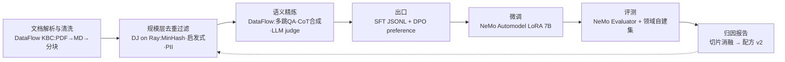

# 03 · 路线图、风险与开放问题

## 1. 90 天 MVP：一个垂直切片，走通完整闭环

**切片选择：「企业私域文档 → 推理增强的 SFT/DPO 数据 → 7B 微调 → 评测报告 → 配方迭代」**

选它的理由：需求最普遍（每个垂直团队都有一堆 PDF）；DataFlow 的 KBC + reasoning 流水线和 `pdf2model` 已经给了 70% 的语义件；DJ 补规模清洗；NeMo 补训练评测——三方能力各用其长，且结果可量化（评测分数）。

**90 天分解**：

| 周 | 交付 |
|---|---|
| 1–3 | 统一样本模式 v0（Arrow）+ `op_trace` 血缘;DataFlow 算子 → Ray `map_batches` 包装器（先覆盖 KBC/reasoning 用到的 ~15 个算子） |
| 4–6 | DJ 适配器（生成 YAML 配方并经其 REST/CLI 执行）;NeMo 格式出口四件套;端到端手动串通第一次 |
| 7–9 | 成本编译器 v0（三档成本标签 + 漏斗重排 + 运行前成本预估）;NeMo-Run 提交 + Evaluator 回流 |
| 10–12 | 归因 v0（按数据源/算子切片做消融小代理训练）;跑 2–3 个真实数据集,写出**公开可复现的对比报告** |

**MVP 的可信度实验（决定项目生死，比功能重要）**：同一份原始语料、同等算力预算下，对比四条产线的下游评测：
1. 仅 DJ 默认配方
2. 仅 DataFlow 默认流水线（单机，能处理多少算多少）
3. FineWeb-Edu 风格基线
4. 本平台混合漏斗产线

**如果 4 不能在「同成本更高分」或「同分数更低成本」上稳定赢，就不存在这个产品**——这是最便宜的证伪点，务必最先做。

## 2. 6 / 12 个月里程碑

**6 个月（从工具到平台）**
- 配方注册表 + 版本化;第二个垂直切片（Text2SQL 或 Agentic RAG 数据，复用 DataFlow 现成流水线）验证配方可迁移性
- 多模态试点：DJ 视频算子 + Curator GPU 去重合一条视频数据产线（蹭 DJ-SORA 的势能）
- 向上游各提 1–2 个实质 PR（DataFlow 的 Ray 化、DJ 的外部算子插件包），确立「友好整合者」身份
- 3–5 家设计合作客户（垂直模型团队），至少 1 家付费 PoC

**12 个月（闭环智能）**
- 归因引擎 v1：influence 近似 + 跨客户配方效果档案（脱敏聚合）
- Agent 工作台 GA：NL→配方→成本预估→执行→报告全程 Agent 化
- 判审蒸馏流水线（LLM judge → 0.5B 打分器）成为标准功能——成本卖点产品化
- 决策点：DataFlex 式训练时选数是否纳入（技术上性感，但侵入训练循环、维护面大，需要客户真实拉动才做）

## 3. 风险清单与对策

| 风险 | 严重度 | 对策 |
|---|---|---|
| **上游 API 剧变**（NeMo 有前科：Hydra→Fiddle、Dask→Ray;DataFlow 1.0.x 快速变动） | 高 | 适配器薄层 + 版本 pin 的「已验证组合」发布（类似 NGC 容器月度节奏）;绝不深入 fork |
| **上游扩张吃掉整合位**（DJ 补 LLM 算子、DataFlow 补 Ray、NVIDIA 扩微服务） | 高 | 速度 + 中立性:三方互为竞对（阿里/北大/NVIDIA），谁也不方便做「跨三方」的编排层，中立第三方反而有位置;把护城河压在归因数据与配方档案（不可复制）而非胶水代码（可复制） |
| **闭环涨点不稳定**（归因是研究前沿，消融贵、influence 近似噪声大） | 高 | MVP 期只承诺「粗粒度但诚实」的切片消融;对外宣传克制,用公开复现报告说话 |
| **LLM 算子成本劝退客户** | 中 | 成本编译器是一级功能而非附件;默认配方全部标注预估成本;判审蒸馏尽早上 |
| **NVIDIA 生态封闭化**（Curator 深度绑 NIM/AI Enterprise） | 中 | 训练/评测层保持双栈:NeMo 之外始终支持 LLaMA-Factory/TRL/vLLM 开源路径 |
| **大客户自建、小客户没钱** | 中 | 锚定中间层（垂直模型团队）;用垂直交付包先造现金流,平台随交付沉淀 |
| **合规**（私域数据出域调 API judge、PII 跨境） | 中 | 全链路支持本地 vLLM/SGLang 判审;PII 算子（DJ 与 DataFlow 都有 Presidio 类件）纳入默认配方;血缘本身就是审计凭证——反向变成卖点 |

## 4. 成功指标（北极星与护栏）

- **北极星：每美元数据成本带来的下游评测增益**（gain-per-dollar）——同时约束「有效」与「便宜」，直指楔子 3+4
- 辅助：配方复用次数（跨客户/跨任务）;从原始数据到出评测报告的端到端时长;LLM 判审成本被蒸馏替代的比例
- 护栏：上游适配器的维护耗时占比（>30% 说明整合策略出了问题）

## 5. 留给你决策的开放问题

1. **身份**：做开源项目起步（先赢生态位，融资叙事是「数据界的 dbt」），还是直接做垂直交付公司（先赢现金流，平台从交付里长出来）？两条路的团队构成完全不同。
2. **首个垂直**：文档→模型是通用切片；若你有特定行业资源（金融/制造/医疗），首切片应该跟着你的资源走。
3. **与上游的关系深度**：只做楔子层，还是争取进入 DJ/DataFlow 的官方生态（成为其推荐的编排层）？后者需要尽早投入社区贡献,值得,但要有人力预算。
4. **地域**：DJ+PAI 是中国云生态,NeMo 是全球 GPU 生态——首发市场选国内（数据合规叙事强）还是出海（付费习惯好）会改变合规与部署架构的优先级。
5. **名字与叙事**：「数据精炼厂」「数据配方平台」「AI 数据操作系统」——对投资人与对客户可能需要两套话术,建议对客户只讲一件事：**「同样的算力预算，更高的评测分数」**。

---

## 附：如果只想先动手验证（本周末就能做的事）

不需要任何平台代码,先手工走一遍闭环找体感：

1. 装 `open-dataflow`,用 KBC 流水线把 50 个 PDF 打成分块 QA（API 模式,几十元成本）
2. 装 `py-data-juicer`,写 10 行 YAML 对上一步产物做去重+启发式过滤,对比前后样本量与质量抽检
3. 用 LLaMA-Factory（比 NeMo 起步快）LoRA 微调一个 7B,自建 50 题领域评测集打分
4. 把「过滤强度」调两档重跑,看分数是否移动——**这就是最小的归因实验**

体感会告诉你：断点在哪、哪步最疼、成本大头在哪——那就是产品该先长的地方。
