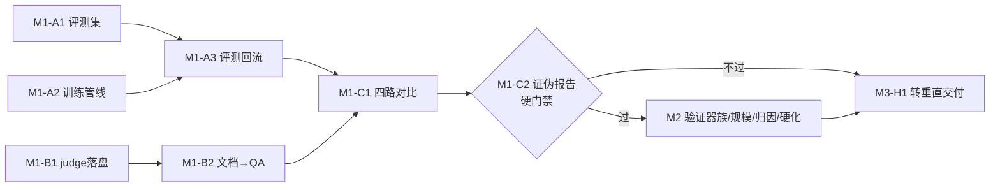

# 08 · 项目管理:按事项拆解(WBS)

> 📌 现状注记(2026-08-15):任务台账已全面迁至 GitHub Issues(触发条件制),本文保留为初期拆解方法史料;实时进度见 docs/25 §7 现状快照。

> 单一事实源是 **GitHub Issues**(本文档是拆解的母版,事项状态以 Issues 为准)。
> 拆解三级:里程碑(M)→ 史诗(Epic,字母)→ 事项(编号)。每个事项必须有
> **可判真伪的验收标准**和**依赖清单**,没有这两样不开工。

## 0. 管理规则(先定规矩,再干活)

| 规则 | 内容 |
|---|---|
| 事项编号 | `[M1-A1]` 格式进 Issue 标题,全局唯一,文档/提交/讨论互相引用 |
| 验收标准 | 每事项写成可执行的判定(如"四路对比中漏斗产线 gain-per-dollar 最高"),不是"做好 XX" |
| 规模标记 | S(≤1 天)/ M(2–4 天)/ L(1–2 周);L 必须再拆,不允许开工 |
| WIP 限制 | 同时进行 ≤ 3 个事项;新事项开工前先关一个 |
| 节奏 | 每周一次"漏斗会":对着北极星(**gain-per-dollar**)砍事项、调顺序;宁可砍功能不砍验收标准 |
| Definition of Done | 代码合入 + 测试绿 + 文档同步 +(如适用)测试实例已部署 |
| 硬门禁(Gate) | M1 的 C2 证伪报告是 M2 的开工条件:结论为负则转向(见第 4 节),不允许"先并行做着" |
| 文档纪律(2026-08-13) | **文档也有死因**:每次节点评审必须裁并或退役章节,只增不删违反自家漏斗哲学(苏格拉底追问暴露) |
| 双轨制(2026-08-13) | 技术轨(本 WBS + gate)× **场景轨**(docs/15 保真阶梯):场景低保真验证(访谈)零建设零收款,**不受 gate 冻结且必须先行**;场景不跳级投入 |
| 提交纪律 | 提交信息引用事项号;一事项一分支或一提交串,不混装 |

## 1. M0 · 已完成基线(v0.1,2026-08)

记录在案,不再立项:算子引擎(过滤/改写/去重/验证/LLM判审)、漏斗编译器、逐样本血缘、
RBAC 鉴权(argon2+JWT+API Key+审计)、设备授权登录(RFC 8628)、MCP harness(8 工具)、
Data-Juicer 开源引擎薄适配、31 例测试、Render 公网测试实例、文档集 01–07 与 GitBook 结构。

## 2. M1 · 证伪冲刺(目标 2–3 周)

**目标:用最小代价回答"同预算下,漏斗混合产线能否稳定做出更高评测分"。这是整个产品的生死问题(docs/03 §1),其他一切让路。**

### Epic A · 评测闭环最小件(数据厂的品控部门)

| 事项 | 内容 | 验收标准 | 规模 | 依赖 |
|---|---|---|---|---|
| M1-A1 | 固定评测集:选定一个领域,构建 50–100 题评测集 + 自动判分脚本 | 同一模型两次评测分数波动 < 2 分;判分无需人工 | M | 无 |
| M1-A2 | 代理模型训练管线:LLaMA-Factory LoRA 7B 一键脚本(数据进,权重出) | 单命令从 output.jsonl 到可评测的适配器,4090/云单卡可跑 | M | 无 |
| M1-A3 | 训练-评测回流:评测分数写回 run 记录,manifest 增加 eval 区块 | `df_get_run` 能看到该 run 产出数据训练后的分数 | S | A1,A2 |

### Epic B · 语义层最小件(自研,不引框架)

| 事项 | 内容 | 验收标准 | 规模 | 依赖 |
|---|---|---|---|---|
| M1-B1 | judge 标注落盘:llm_judge_filter 的打分自动积累为蒸馏训练集 | 跑完一次 judge 流水线即产出 `judge_labels.jsonl`(文本,分数,理由) | S | 无 |
| M1-B2 | 文档→QA 合成算子:分块 + QA 生成 + judge 过滤(三算子一链) | 50 页 PDF 文本进,≥200 条通过 judge 的 QA 对出,全程血缘完整 | M | B1 |

### Epic C · 证伪实验本体

| 事项 | 内容 | 验收标准 | 规模 | 依赖 |
|---|---|---|---|---|
| M1-C1 | 四路对比实验:同一语料、同一预算上限,跑 ①仅启发式 ②仅 LLM 算子 ③FineWeb-Edu 风格打分器 ④漏斗混合,各训各评 | 四组 (成本,分数) 数据点齐;预算差异 < 5% | L→拆:C1a 语料与预算固定(S)、C1b 四条流水线配置(M)、C1c 执行与记录(M) | A3,B2 |
| M1-C2 | 公开复现报告:数据来源、四配方、成本、分数、结论全公开进 docs | 第三方按文档可复跑;报告明确回答"gate 过/不过" | M | C1 |

**M1 北极星判定:④ 在 gain-per-dollar 上稳定优于 ①②③ → gate 通过,进 M2 平台化;
否则执行第 4 节的转向预案。**

## 3. M2 · 平台化(4–6 周,gate 通过后开工)

### Epic D · 验证器族 v1(质量护城河,docs/04 第一优先级)
- M2-D1 代码执行验证器:子进程沙箱(资源/超时/网络限制),pass@k 判定 —— 验收:恶意样本(死循环/读文件)全被拦,正确代码样本通过率 100%(M)
- M2-D2 数学验证器强化:SymPy 等价判定替换字符串比对 —— 验收:等价表达式(1/2 vs 0.5 vs \frac{1}{2})判同(S)
- M2-D3 SQL 验证器:双库执行结果比对 —— 验收:等价不同写法的 SQL 判同,错误 SQL 判异(M)

### Epic E · 规模与执行
- M2-E1 Ray 分片执行器:算子协议不变,runner 换底 —— 验收:100 万样本数据集在 4 节点跑通,结果与单机一致(L→再拆)
- M2-E2 流式 I/O:去掉 50 万单机内存上限 —— 验收:内存占用与数据集大小解耦(M)

### Epic F · 归因 v0(配方资产的起点)
- M2-F1 切片消融调度:按来源/算子切片自动重训代理模型 —— 验收:一条命令输出"哪个切片贡献了多少分"表(L→再拆)
- M2-F2 配方版本化:recipe 注册表 + 与评测分数关联 —— 验收:同配方跨数据集的历史效果可查询(M)

### Epic G · 产品硬化
- M2-G1 速率限制 + 登录失败锁定(S)
- M2-G2 OIDC 对接开源 IdP(Keycloak/Casdoor)(M)
- M2-G3 Web 控制台只读版:数据集/运行/报告三页(M)

## 4. M3 · 商业验证(与 M2 并行启动访谈,交付在 gate 后)

- M3-H1 垂直切片打包:「文档→SFT/DPO→微调→评测报告」一键交付物 —— 验收:陌生环境 30 分钟内完整跑通(M,依赖 M1 全部)
- M3-H2 设计合作客户:3 家垂直模型团队深度访谈,1 家付费 PoC —— 验收:访谈纪要进 docs,PoC 合同或明确拒绝理由(L,持续)
- M3-H3 定价验证:按 docs/02 §6 的锚点做 2 个报价方案并测试反应(S,依赖 H2)

**M1 gate 不过的转向预案**:平台化(M2 D/E/F)冻结;资源转向 M3-H1 的纯交付形态
(人工调配方 + 工具辅助),用交付现金流养研发,归因引擎降级为内部工具再迭代。

## 5. 依赖关系图

## 6. 与 Issues 的对应

M1 全部事项已建为 GitHub Issues(标题带 `[M1-xx]` 编号,正文含验收标准/规模/依赖),
外加一个「路线图总览」置顶 issue 链接全部事项。

**M2/M3 已于 gate #7 通过后建单(2026-08-14)**:M2 = #9–#19(D:#9-12 / E:#13-14 /
F:#15-16 / G:#17-19),M3 = #20–#23;总览 #8 已更新为索引。建单时的证据驱动增项:
#12(math_zh_v2,3B 天花板效应)、#23(支付宝闭环,gate 后首批②);触发条件制事项
(#18 OIDC、#14 分片)立册占位不占 WIP。
