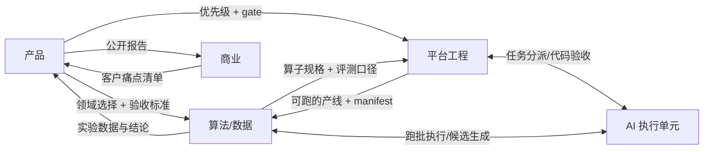

# 09 · 团队分工:领域划分与事项归属

> 在 08 的事项拆解之上加"域 × 人"一层:四个领域 + 一个横向 AI 执行单元。
> 每个事项两个字段:**Owner**(拍板与验收,只能是人)、**Exec**(执行,可以是人或 AI)。
> 原则:**判断归人,执行尽量归 AI;谁 Owner 谁写验收标准,谁验收谁关 issue。**

## 1. 四个领域 + 一个执行单元

| 域 | 职责边界(管什么) | 不管什么 | 核心产出物 |
|---|---|---|---|
| **产品** | 定义"什么算好":垂直领域选择、每事项验收标准把关、**gate 判定**、优先级(主持每周漏斗会)、试驾体验 | 不管怎么实现 | 验收标准签字、每周砍单决定、gate 结论 |
| **算法/数据** | 质量的生产函数(docs/04):评测集口径、判别器/验证器设计、**实验设计**(四路对比的科学性)、归因方法、prompt 工程 | 不管服务与部署 | 评测口径、实验报告、算子规格(给平台工程化) |
| **平台工程** | 系统与基础设施:服务/执行器/鉴权/部署/算子工程化/测试 | 不管数据好不好 | 可运行可测试的代码、部署实例 |
| **商业** | 客户访谈、定价、交付打包、对外叙事(公开报告与全书的传播) | 不管产线内部 | 访谈纪要、报价方案、PoC 合同 |
| **AI 执行单元(Claude Code)** | 横向执行力,不是域:承接标了 `AI可执行` 的事项;经 MCP 驱动平台本体 | **不做 Owner、不做 gate 判定、不定验收标准** | 代码/文档/实验执行记录,交人验收 |

**AI 可执行的判定标准**:输入输出清楚 + 验收标准可自动判定 + 不含"什么算好"的判断 → 可派 AI。
反例:评测集口径(#1 的核心)、四路实验的设计(#6 的核心)、gate 判定(#7)——这三件是人的判断,AI 只能打下手。

## 2. M1 事项归属(与 Issues #1–#7 对应)

| 事项 | Owner | Exec | 说明 |
|---|---|---|---|
| #1 M1-A1 评测集 | **算法** | 算法 + AI 辅助 | 领域选择由**产品**先拍板(前置小决策);口径与题目是算法判断,AI 可生成候选题供筛 |
| #2 M1-A2 训练管线 | 平台 | **AI 可执行** | 纯工程,验收自动判定;算法提供固定超参 |
| #3 M1-A3 评测回流 | 平台 | **AI 可执行** | 纯工程 |
| #4 M1-B1 judge 落盘 | 平台 | **AI 可执行** | 纯工程 |
| #5 M1-B2 文档→QA 链 | **算法** | AI 执行工程,算法定 prompt 与质检标准 | 双人协作事项:算子外壳(平台规格)+ 生成质量(算法) |
| #6 M1-C1 四路对比 | **算法** | AI 执行跑批,算法设计实验 | 预算口径由产品确认;实验设计的科学性是本事项的灵魂 |
| #7 M1-C2 报告 + gate | **产品** | 算法写数据结论,AI 辅助成文,商业把关对外叙事 | gate 判定只能是产品(你),不可下放 |

**关键路径上的人力瓶颈**:#1 和 #6 的判断部分。其余五项的执行都可以并行派给 AI。

## 3. M2 / M3 归属(gate 后建 issue 时直接带上)

| 史诗 | Owner | Exec |
|---|---|---|
| M2-D 验证器族 | 算法 | AI 执行(D1 代码沙箱/D3 SQL 双跑是纯工程),算法定判定规则 |
| M2-E Ray 分片/流式 | 平台 | AI 可执行,平台做架构评审 |
| M2-F 归因 v0 | 算法 | 方法归算法,调度工程归 AI |
| M2-G 硬化(限流/OIDC/控制台) | 平台 | AI 可执行;G3 控制台的信息架构由产品参与 |
| M3-H 商业验证 | 商业 | 人为主(访谈/谈判不可 AI 代理),交付打包的工程件派 AI |

## 4. 域间接口(交接物,防"都在做但接不上")

- 产品 → 算法:**每个事项开工前,验收标准由产品签字**(写进 issue,勾选框)
- 算法 → 平台:算子规格 =(输入 schema、输出 schema、成本档、预期留存、判定规则)五元组
- 平台 → 算法:每条产线交付必须带 manifest + 血缘,算法只认带血缘的数据
- 任何人 → AI:派单 = 指着一个 issue 说"开工 #N";AI 交付后 Owner 验收关单

## 5. 人数配置(角色是固定的,帽子随人数分配)

**配置一:1 人 + AI(现状)**
- 你 = 产品 + 算法判断 + 商业;AI = 平台工程全部 + 算法工程执行
- 你的时间只花在三处:#1 评测口径、#6 实验设计、#7 gate 判定;其余全部派单
- 风险:算法深度受你个人时间限制——这决定了下一个雇员是谁

**配置二:2 人 + AI(第一次招聘)**
- **先招算法/数据工程师**(不是平台工程师):因为护城河在评测/验证器/归因(docs/04),而平台工程是 AI 替代率最高的域
- 你 = 产品 + 商业;新人 = 算法/数据;AI = 平台工程 + 跑批

**配置三:4–5 人 + AI(gate 通过、有付费 PoC 后)**
- 产品 1(你)、算法/数据 2(评测与验证器 1、归因与实验 1)、平台 1(架构与 AI 派单验收)、商业 1
- 平台域保持 1 人 + AI:人的职责是架构决策、代码评审、AI 任务验收,不是写全部代码

## 5.1 Owner 代理备注(2026-08-11 生效)

经委托,**Claude 代理担任四域 Owner**(产品/算法/平台/商业)推进项目;委托人转为协助方,
保留两项不可转移的权力:**资源供给**(API/GPU/资金)与**最终否决权**(对 gate 判定与对外动作)。
代理 Owner 的决策一律显式留痕(issue 评论 + docs 决策记录),重大判定(gate、对外发布、花钱)
执行前向委托人报备,否决窗口内无异议再执行。

## 6. 落到追踪器的执行规则

- Issue 标签加两组:`域:产品 / 域:算法 / 域:平台 / 域:商业` 与 `AI可执行`
- Issue 正文顶部加一行:`Owner: @某人 | Exec: 人名或 AI`
- 每周漏斗会按域过单:每域 Owner 汇报本域在制事项(全局 WIP ≤ 3 不变)
- AI 交付的事项,**验收动作必须由 Owner 完成**(跑一遍验收标准的勾选框),AI 不自我验收
