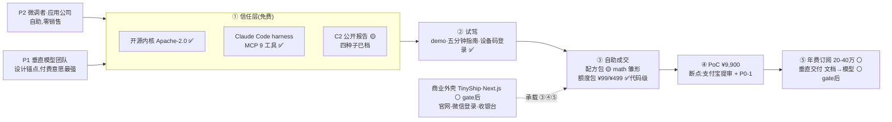
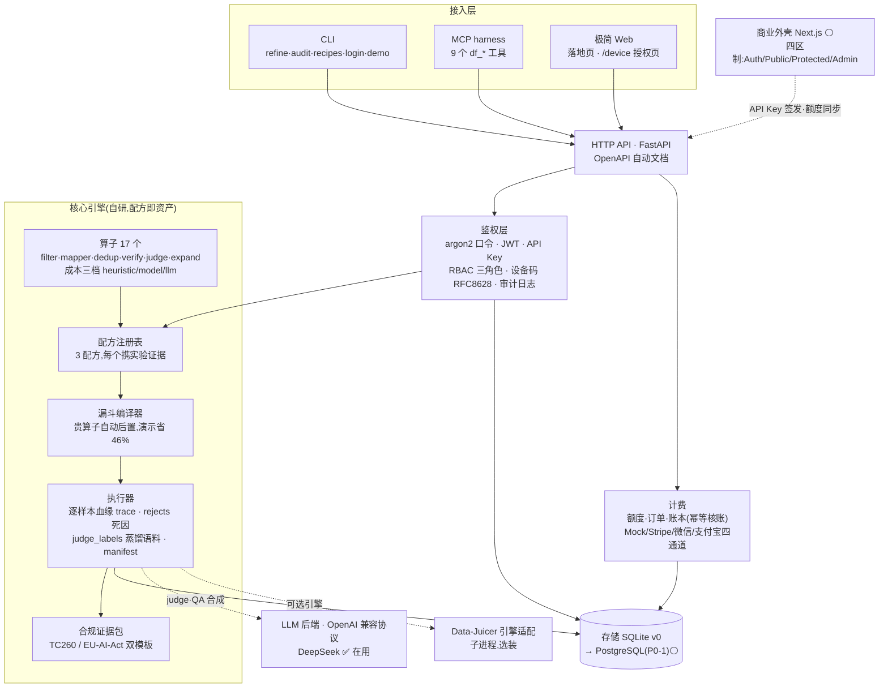
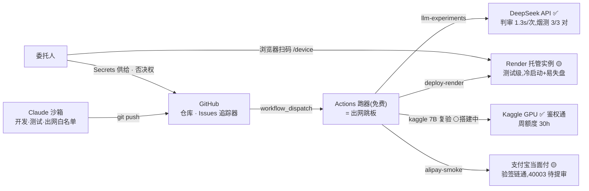
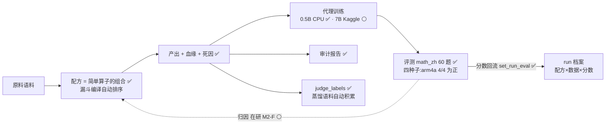

# 18 · 架构总览(产品架构 × 技术架构,一页看全)

> ⚠️ **本文已退役(2026-08-15)**:内容停留在 M0/M1 时代。当前架构入口请读 **[docs/25 · 架构总纲](25-架构总纲.md)**;本文仅作历史记录保留。

> 委托人要求(2026-08-13):整体产品与技术架构图。四张图 + 一张对照表,与代码现状严格对齐:
> **✅ = 已建成且有测试实证;🟡 = 测试级/部分;⚪ = 规划(多为 gate 后);虚线 = 尚未接通的边**。
> 各部分细节展开:产品见 docs/02/14/15,平台见 docs/05,商业外壳见 docs/10/13,计费见 docs/11。

## 1. 产品架构:卖什么、给谁、怎么流转

一句话:**开源建信任 → 报告证效果 → 自助成交 → PoC → 大单**;凡"判断类核心资产"只进付费层。

| 产品形态 | 状态 | 商业角色 |
|---|---|---|
| 开源内核 / harness | ✅ 可用(57 例测试) | 不卖,获客漏斗顶部 |
| 公开报告(C2) | 🟡 四种子数据齐,LLM 组并入中 | 营销资产,可复现=可信 |
| 托管实例(Render) | 🟡 测试级 | 自助订阅载体,P0-1 后承接付费 |
| 配方包(买断) | 🟡 首个雏形 = math_zh_funnel_v1 | 类 boilerplate 售卖 |
| 额度包/PoC 包 | ✅ 代码级(下单→扫码→核账→扣减全链) | 自助/首单成交物 |
| 合规证据包 | ✅ `datafoundry audit` | 差异化卖点(监管刚需) |
| 商业外壳 | ⚪ gate 后购建 | 渠道,不是商品 |

## 2. 技术架构:平台现状(as-built)

**权限即架构**:Agent(MCP)与人(CLI/Web)走同一 API、同一鉴权——Agent 能力严格等于其
API Key 对应角色;收银台在外壳、**账本在内核**(docs/11 边界)。

## 3. 部署与跳板拓扑(环境约束下的实际打法)

沙箱出网受白名单限制,**GitHub Actions 跑器是唯一的完整外网跳板**——部署、实验、支付烟测全部经它。

## 4. 数据闭环:产品论点的落地现状

论点「配方 + 效果归因」——**配方半场已工程化,归因半场在研**(docs/17 论点级评审)。

## 5. 模块对照表(图 → 代码 → 文档 → 实证)

| 架构件 | 代码 | 文档 | 实证 |
|---|---|---|---|
| 算子/配方/漏斗/执行器 | `registry.py` `ops/` `recipes.py` `pipeline.py` `runner.py` | docs/05 | refine 复现实验档案逐数一致 |
| 合规证据包 | `audit.py` | docs/16 R1 | 真实语料 4000 抽样通过 |
| 鉴权/设备码 | `security.py` `server.py` `credentials.py` | docs/06 | 干净环境全流程试驾 |
| 计费四通道 | `billing.py` `store.py` | docs/11 | mock/Stripe 全测;支付宝到 40003 |
| MCP harness | `mcp_server.py` | docs/05 | 真机烟测 |
| 引擎适配 | `engines/datajuicer.py` | docs/13 §3 | 测试覆盖 |
| 实验/证据线 | `evalsets/` `experiments/` `scripts/` | RESULTS.md | 四种子统计入档 |
| 跳板工作流 | `.github/workflows/`×6 | docs/18 §3 | 部署/实验/烟测全经此实证 |
| 测试 | `tests/`×9 文件 | — | **57 例全绿** |

**一句话读架构**:内核是一台「带账本、带审计、Agent 可驾驶的数据精炼机」;它的每个对外承诺
(省成本、可追溯、可复现、合规)都对应图中一个已建成的构件,而不是 PPT 上的框。
