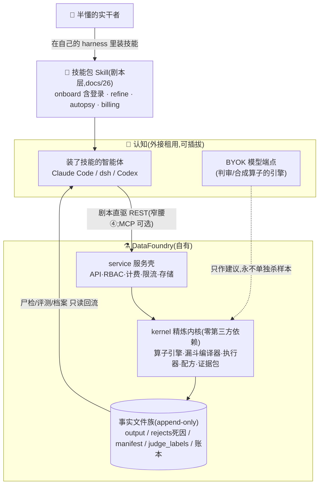
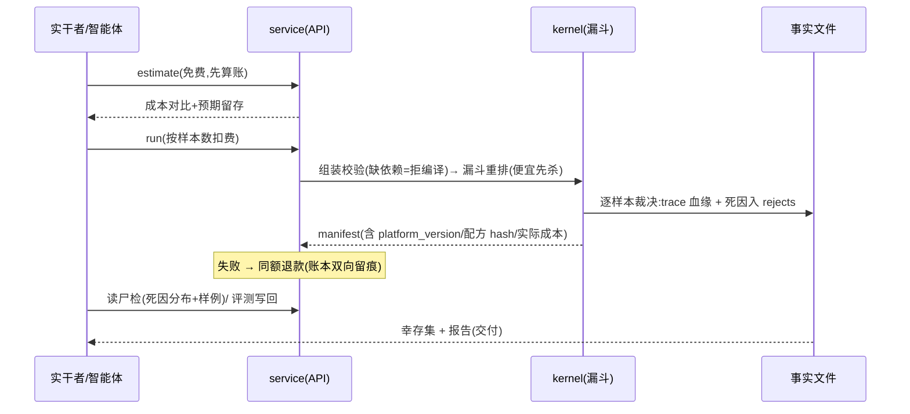

# 25 · 架构总纲:一文读懂 DataFoundry(2026-08-15)

> **本文是全部架构文档的唯一入口**:十分钟读完全貌,细节由文末地图分流到专篇。
> 每次架构级变更必须同步本文(纪律见 §9)。旧总览 docs/18 已退役。

## 0. 一句话与一张图

**DataFoundry = 训练数据的品控与归因层**:让每一条数据的去留都有可辩护的理由。
原生的是认知(租),确定的是裁决与账本(自有)。

主链四段:**意图 →(AI)配方提案 →(人)授权 →(系统)精炼事实**。
AI 只进前两段,授权只属于人,事实只出自系统——这条线就是安全线。

## 1. 卖什么,卖给谁(30 秒版)

给**半懂的实干者**(懂一点算法、要交付结果的人):你交数据和预算,我们交回
**幸存数据 + 每条被杀样本的死因 + 能交差的报告**。先算账再干活(估算永远免费),
失败不收钱(自动退款),每个对外数字可复现(seed+sha256+run id)。
实证素材:BELLE 热门语料尸检——19,999 条中 **4.04% 解答自己把算术算错**,
30 条样例全部一眼可复核(经四轮仪器自检 13.62%→4.04%,过程本身即产品主张)。

## 2. 一次精炼如何流过系统

## 3. 结构的三个视角(同一系统,三种切法)

**① 技术三域(= 目录 = 发行边界,tests/test_domains 守护)**

| 域 | 内容 | 依赖规则 |
|---|---|---|
| `kernel/` | schema·算子·漏斗·执行器·配方·证据包 | **纯标准库零依赖**(可嵌入/端侧/私有化) |
| `service/` | API·存储双后端·认证·计费·限流 | `pip install datafoundry[server]` |
| `interface/` | CLI·MCP 薄客户端 | 只经 HTTP 窄腰访问服务 |

**② 业务七上下文(DDD,docs/22)**:精炼(核心域,聚合根 Run)· 配方(Recipe,hash 即身份)·
证据与合规 · 账务(Order→Ledger)· 身份与门禁 · 接入 · 组装与存储。
五大防腐层:引擎 subprocess / 支付 provider / 存储方言 / 认知 BYOK+REST 窄腰(MCP 可选)/ **Mission 跑器座**(dsh headless 与 Claude Code 双跑器,纳入而不结婚)。

**③ 五层视角(BMS 对照语言,docs/21 §1)**:体验 L1 → 应用 L2 → 智能体与模型 L3(认知外接)→
治理内核 L4(裁决权所在)→ 事实底座 L5。

## 4. 什么永远不变(五律浓缩,docs/21 §5)

- **I1** 每条处置必有可追溯死因(trace append-only)
- **I2** 裁决确定性:同输入+同配方+同平台版本 → 同输出;AI 只建议
- **I3** 资金唯一写入点、同事务、幂等
- **I4** 对外数字必可复现;不可复现不外发
- **I5** 认知可替换:任何 agent/模型都是可插拔外设

四条窄腰:样本 schema / 算子协议(含依赖契约)/ 事实文件族 / 认知接入面(REST,技能剧本直驱;MCP 为可选适配器)。
窄腰之外一切实现可翻新(流式化、拆包、换存储均未动窄腰,实证)。

## 5. 安全线(四条"永不")

判审永不单独杀样本 · AI 永不改配方边界/动账本/放行交付 · 花钱必在人授预算内
(Mission 只花预授预算,超即停)· 管理面永不进 MCP,**支付授权**永不进 MCP(建单/查余额可进,docs/26)。

## 6. 关键决策一览(每条一行,出处可溯)

| 决策 | 一句话 | 出处 |
|---|---|---|
| 认知外接 | 不造大脑,造大脑愿意用的手与不会说谎的账本 | 21 §4 |
| 不写 harness,做发行版 | 内核已商品化,发行版才是生意(技能包+薄包装,一鱼三吃) | 21 §4-5,#26 |
| 端侧三载体 | 零依赖内核+蒸馏模型+同构协议,不写通用运行时 | 21 §4-6,#27 |
| 部署粗粒度 | 细粒度组合=频率×重建成本,我们双低,重启+外部状态正确 | 21 §4-2 |
| 依赖显式声明 | requires/provides_stats,缺即拒编译(fail loud) | 22 §5 |
| 拆包 v0.2 | 域即目录,基座零依赖,包边界=部署边界 | 21 §7 |
| 私有仓+证据橱窗 | 产品代码私有,战役证据公开(委托人定) | 23 §6 |
| **Skill 优先** | harness 装技能,技能带登录;操作台=用户自己的 harness;验收=Skill 走查 | **26**,#29 |
| **MCP 降级** | Skill+HTTP 为主通道,MCP 为可选适配器;新能力先落 REST+Skill | 26 §7 |
| **dsh 纳入** | Mission 首选执行基座,经跑器座防腐层;双跑器验收,纳入而不结婚;数据面与多租户托管不纳入 | 21 §4-3,#25 |
| 失败退款/版本入事实 | 苏格拉底审问所修两缺陷 | 24 Q3/Q5 |

## 7. 现状快照(2026-08-15)

v0.2.0 线上(Render+PG 账本,支付宝电脑网站支付已通,首单待付)· **140 测试全绿** ·
Skill 优先全链已生产实测(注册 200/登录 token/控制台 401 门禁)· 技能包四件套已落库 ·
演进位置 R3 → M2 进行中(5/11:#17 #10 #13 #16 #19 已关)· 战役 S0 完成(4.04%),S1 在排 ·
issue 总账:#24 战役 · #25 dsh 接入 · #26 发行版 · #27 端侧 · #28 体验债 · #29 Skill 优先(平台侧已完)。

## 8. 文档地图(哪个问题,读哪篇)

> 视觉版架构图:`assets/arch/datafoundry-arch-v3.html`(Skill 优先 v3)。

| 想知道 | 读 |
|---|---|
| 为什么做这个产品/竞品格局 | 01-04, 19 |
| 商业化与定价/画像/对外话术 | **14**(§11 八问·画像·能力直陈) |
| **技术架构:分层/分域/选型快照** | **27** |
| 技术选型的决策史(落选与重估触发) | 13 |
| 五层目标架构/五律/域图/外部对照 | **21** |
| 统一语言/上下文/防腐层/领域事件 | **22** |
| 角色/旅程/状态机/用例投影矩阵 | **23** |
| 领域审问方法与战果 | 24 |
| 复现实验与 gate 报告 | 20, experiments/ |

## 9. 纪律

- 本文是**入口与摘要**:与专篇冲突时以专篇为准,发现冲突者负责消解并留痕
- 架构级变更(域/窄腰/不变量/安全线/关键决策)必须同步本文,否则评审不过
- 图与代码不符视为缺陷(mermaid 图随窄腰/域变更同步)
