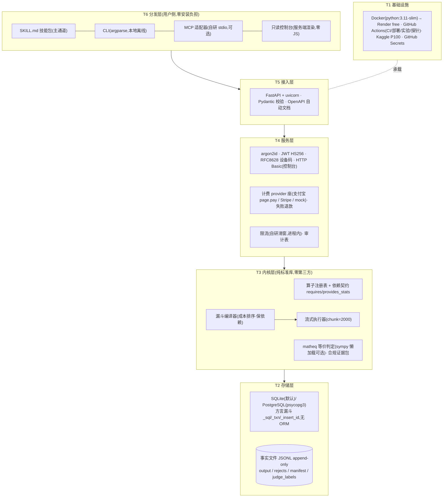

# 27 · 技术架构:分层、分域与技术选型(2026-08-15,as-built 快照)

> 本文回答**"现在用的是什么、放在哪一层、为什么"**;docs/13 是选型决策史(落选备选与
> 重估触发),两文冲突以本文为准、修订者两边同步。产品视角的架构入口在 docs/25 总纲。
> 本文无蓝图成分:每一项都对应仓库里在跑的代码或在册的 issue。

## 0. 技术栈一图

## 1. 技术分层(职责 · 技术 · 关键约束)

| 层 | 职责 | 技术 | 关键约束 |
|---|---|---|---|
| **T6 分发** | 把产品送进用户的 harness | SKILL.md 四件套(主)· argparse CLI · 自研 MCP stdio(~150 行,可选)· 控制台三页(f-string 渲染) | 技能纯文本零安装;控制台升格规划 = docs/28 toC 看板平台(#30),现役只读 |
| **T5 接入** | HTTP 窄腰 | FastAPI 0.141 · uvicorn 0.52 · Pydantic 模型校验 | 一切认知体只从这进(窄腰④);/docs 即接口文档 |
| **T4 服务** | 认证/钱/门禁/留痕 | argon2-cffi 25.1(Argon2id)· PyJWT 2.7(HS256)· RFC 8628 设备码全套 · HTTP Basic(仅控制台)· 自研 SlidingWindow+LoginGuard · python-alipay-sdk(电脑网站支付)· 审计表 | 资金唯一写入点、同事务、幂等;失败 run 同额退款;支付授权永远人手 |
| **T3 内核** | 裁决与证据(产品本体) | 纯 Python ≥3.10 标准库:注册表(含依赖契约)· 漏斗编译器 · 流式执行器 · 自研 MinHash-LSH(hashlib+struct)· matheq(L0 精确/L1 Fraction/L2 sympy 懒加载)· 验证器族 · 证据包 | **零第三方依赖(测试守护)**;缺依赖=拒编译;同输入+同配方+同平台版本→同输出 |
| **T2 存储** | 事实持久化 | SQLite(默认零运维)/ PostgreSQL 16(psycopg3 [pg] extra);方言漏斗 `_sql`(?→%s)/`_txn`/`_insert_id`;JSONL 事实文件 | 无 ORM(SQL 手写,双后端同测);事实 append-only;余额=SUM(账本) |
| **T1 设施** | 跑与守 | Docker python:3.11-slim → Render free(自动部署工作流)· GitHub Actions(tests 双后端 job / deploy / 实验 / real-corpus / render-diag 探针)· Kaggle kernel(P100)· GitHub Secrets(+::add-mask::) | 一切实验产物带 seed+sha+run id;构建日志可经探针工作流拉取 |

## 2. 分域 × 技术映射

**技术三域(目录=发行边界,tests/test_domains 六条 AST 守卫)**

| 域 | 安装 | 允许依赖 | 技术要点 |
|---|---|---|---|
| `kernel/`(9 模块) | `pip install datafoundry` | **仅标准库**+kernel | 可嵌入/端侧/私有化直用;sympy 等可选件只许函数内懒加载 |
| `service/`(6 模块) | `+[server]`(fastapi/uvicorn/PyJWT/argon2)、`[pg]`、`[billing-alipay]` | 第三方+kernel,禁引 interface | 组合根 server.py;console 独立模块 |
| `interface/`(3 模块) | 随基座 | 标准库+kernel | CLI 本地流;MCP 为 HTTP 薄客户端 |

**业务上下文 → 技术载体(域模型见 docs/22)**

| 上下文 | 模块 | 核心技术 |
|---|---|---|
| 精炼(核心域) | kernel 七件 | 注册表+依赖契约 · 漏斗编译 · 流式 chunk 执行 · 自研去重/验证器 |
| 配方 | recipes | 步骤 JSON + sha256 前 12 位 hash(hash 即身份) |
| 证据与合规 | audit | 纯函数投影(死因分布)→ TC260/EUAI 口径报告 |
| 账务 | billing + store 表 | provider 座 · webhook RSA2 验签 · 幂等入账 · 失败退款 |
| 身份与门禁 | security/ratelimit | Argon2id · JWT · 设备码 · 滑窗限流(注入时钟可测) |
| 接入 | cli/mcp_server/credentials | argparse · stdio JSON · 0600 凭据文件 |
| 组装与存储 | server/store/console | FastAPI 组合根 · 方言漏斗 · Basic 认证只读页 |

## 3. 技术选型总表(现役;落选备选与重估触发详见 docs/13)

**语言与运行时**

| 项 | 选择 | 一句话理由 | 退路(律四) |
|---|---|---|---|
| 语言 | Python ≥3.10 | 数据生态母语;内核 stdlib 纪律使其零负担 | 端侧嵌入场景触发 Rust/WASM 算子内核移植(#27) |
| 打包 | setuptools + **零依赖基座 + extras** | `pip install datafoundry` 即内核;服务按需 `[server][pg][billing-*]` | extras 变更必同步 Dockerfile/CI(已两次实证教训) |
| 执行形态 | 单机流式(chunk 2000,内存 O(chunk+去重状态)) | 50 万上限已由流式解除 | 千万级触发 Ray(docs/13;DJ 引擎座已留) |

**Web 与安全**

| 项 | 选择 | 理由 | 退路 |
|---|---|---|---|
| Web/ASGI | FastAPI + uvicorn | 类型契约+自动 OpenAPI | 多进程需求加 gunicorn 托管 |
| 口令 | argon2-cffi(Argon2id) | OWASP 首选,支持参数升级 | — |
| 令牌 | PyJWT HS256 | 单实例事实标准 | 多实例评估 RS256/JWKS |
| 无浏览器登录 | **RFC 8628 设备码**(自实现) | 为 agent/CLI 而生;密码永不经智能体 | 口令直登保留为后备 |
| 控制台认证 | **HTTP Basic** | 浏览器原生、零会话设施、直连 RBAC(HTTPS 前提) | **已立项 #30**:看板平台 30-A 落地时退役,转签名 cookie 会话(docs/28 §4) |
| 限流 | 自研 SlidingWindow + LoginGuard(进程内,注入时钟) | 单实例够用,零依赖可测 | 多实例部署触发外置(Redis 类),现禁 |

**数据与存储**

| 项 | 选择 | 理由 | 退路 |
|---|---|---|---|
| 元数据 | SQLite 默认 / **PostgreSQL 双后端**(psycopg3) | 本地零运维;云上账本必须外置(P0-1 实例休眠丢单事故驱动) | 方言漏斗已抽象,换 Neon/Supabase 零业务改动(#23 迁移在册) |
| ORM | **不用**(SQL 手写 + 方言漏斗) | 表少查询直白;双后端同测(sqlite+PG CI 双 job) | 表结构复杂化时重估——目前无迹象 |
| 数据交换 | JSONL(事实文件 append-only) | 流式友好、人可读、审计即文件 | 列裁剪需求触发 Parquet/Arrow |

**算法与验证(产品本体,均自研)**

| 项 | 选择 | 理由 |
|---|---|---|
| 算子引擎 | 自研 17+ 算子,成本三档,依赖契约组装期校验 | 配方是核心资产,表达必须自持;缺依赖=拒编译 |
| 去重 | 自研 MinHash-LSH(hashlib+struct,增量语义) | 零依赖;参数可按语料校准 |
| 数学等价 | 自研 matheq 三级(精确/Fraction/sympy 懒加载) | 判分协议单源(str/int 事故后立);字符白名单防注入 |
| 算术自洽验证 | 自研 v3.1(带余数/取整/四舍五入/惯用语豁免) | 惯例知识库=第二种知识资产,四轮仪器自检沉淀 |
| LLM 后端 | OpenAI 兼容 HTTP(stdlib urllib,BYOK env) | 一套协议通吃,零 SDK;判审只建议+20% 熔断 |

**分发与集成**

| 项 | 选择 | 理由 |
|---|---|---|
| 主分发 | **SKILL.md 技能包**(纯文本,Claude Code/dsh 通用) | harness 装技能,技能带登录(docs/26);分发摩擦≈零 |
| MCP | 自研 stdio JSON(~150 行) | 降级为可选适配器,不再扩建 |
| 支付 | python-alipay-sdk(电脑网站支付 page.pay)+ provider 座 | 匹配已签约能力;Stripe/微信同座待启 |
| 引擎座 | Data-Juicer 经 subprocess(选装) | 进程边界即防腐层;开源算子当零件 |
| Mission 跑器座 | **dsh headless(Python SDK)/ Claude Code 会话,双跑器**(设计定案,建设按 Mission 触发) | 托管运营的执行基座;session log 采集为我们的档案;同剧本双跑器验收,纳入而不结婚 |

**工程与运维**

| 项 | 选择 | 理由 |
|---|---|---|
| 测试 | pytest 140 例,含 **AST 架构守卫**(域边界/依赖契约/顶层纯净) | 架构规则=会咬人的测试,不是文档自觉 |
| CI/CD | GitHub Actions:tests(sqlite+PG 双 job)· deploy-render · 实验族(kaggle/llm/real-corpus)· render-diag(构建日志+生产探针) | Actions 即跑器:实验/部署/尸检/冒烟一处管 |
| 部署 | Docker(python:3.11-slim)→ Render free;HF Space 兼容同镜像 | 单体+状态外部化=粗粒度定律的正确点位 |
| GPU | Kaggle kernel 跳板(P100 已验证全栈 torch 2.4.1+cu118) | 免费额度;T4 x2 待委托人一键 |
| 密钥 | GitHub Secrets + env 注入;连接串 ::add-mask:: | 密钥永不进仓库/日志;RSA2 webhook 验签 |
| 文档 | GitBook 结构(SUMMARY)+ GitHub 原生 mermaid | docs/25 为唯一架构入口 |

## 4. 横切技术决策

1. **零依赖内核是不变量不是现状**:AST 测试守护,可选件(sympy/psycopg/uvicorn)只许函数内懒加载。
2. **无 ORM、无 Redis、无消息队列、无微服务**:单体 + 状态外部化(PG);细粒度组合 = 频率×重建成本,我们双低(docs/21 §4)。每个"无"都有触发条件,不是永远。
3. **append-only + 纯函数投影**:事实不可改,视图可重放(死因分布/余额/阶段)。
4. **幂等纪律**:支付回调幂等已达标;run 建立 client_token 在册(#28)。
5. **验收即走查**:平台功能验收 = Skill 走查(docs/26 §4);生产验证 = render-diag 探针(注册/登录/门禁冒烟)。

## 5. 诚实边界(已知技术债,全部在册)

| 边界 | 现状 | 触发/去向 |
|---|---|---|
| 限流为进程内存态 | 单实例正确 | 多实例部署时外置 |
| API 层上传计数走全量 load_jsonl | 已知边界 | #14 分片执行器统一 |
| Render free PG 30 天上限 | ~2026-09-13 到期 | #23 迁 Neon(方言漏斗已备,零业务改动) |
| 免费实例冷启动 ~50s | 首请求慢 | 技能剧本已写明;付费档或常驻触发升级 |
| 无独立观测栈 | audit 表 + Actions 日志 + 探针工作流 | 真实流量出现后立项,现不建 |
| 控制台 Basic 认证 | HTTPS 前提下可接受(只读) | **#30 已立项**(docs/28):30-A 转会话 cookie,Basic 退役 |

## 6. 选型五原则(全部有实证锚点)

1. **能租不建**:认知(harness/模型)、支付、跑器(Actions/Kaggle)、托管(Render)全租。
2. **标准库优先**:内核零依赖不是节俭是战略(可嵌入/端侧/私有化的结构保证)。
3. **窄腰外随便换**:四条窄腰稳定,其余实现已多次整体翻新而未破坏任何消费者。
4. **每个依赖必有实测退路**:零 LLM 62.5 分、PG↔SQLite 互退、Actions 挂有本地复现路径。
5. **触发条件制**:Ray/Parquet/Redis/SSO/WASM 全部"立册不开工",触发写明,防提前建设。
