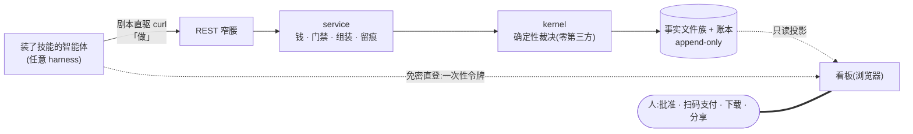

# 29 · Agent 原生平台脚手架(通用蓝图,2026-08-15,委托人「这种架构是通用的」指令)

委托人三点(逐字):**① skills 里面有平台的功能,还有展示;② 专注于平台;③ 具有领域。**

本文把 DataFoundry 验证过的架构抽成**可开新仓直接套用的脚手架**。纪律:每条规则都带
本仓实证锚点(〔锚〕文件/测试/工作流)——不是理论,是从跑通的系统里拆出来的;
没有锚点的规则不许写进本文。

## 0. 适用判定(先判断,再套用)

**适用**:给**住在 harness 里的用户**(Claude Code / dsh / Codex…)造平台;产品可信度
靠**可复核的事实**撑;存在**真金白银或不可逆动作**(必须留人手环节)。
**不适用**:纯内容站、实时协作画布、事实无从谈起的产品。

一句话形态:**技能负责做,平台负责裁决与记账,看板负责看见——三者共享同一条窄腰
与同一堆事实。**

## 1. 一图总览



三个入口,一个心脏:harness 走窄腰干活,看板读事实看账,人只在琥珀色环节出手。

## 2. 支柱一:技能层——功能与展示都是剧本(公理①)

- **Skill = 纯文本剧本**:装进 `~/.agents/skills/` 即用,跨 harness 通吃;分发摩擦≈0,
  这就是获客漏斗第一级。〔锚〕skills/ 四件套
- **剧本两向**(委托人第①点的正名):
  - **干活向**:剧本教 agent 直驱 REST(curl)——零配置零常驻进程;MCP 只是可选适配器,
    新能力永远先落 REST+Skill。〔锚〕docs/26 §7 渠道裁定
  - **展示向**:剧本持存盘 key 换**一次性登录链接**交给人,浏览器点开即入看板——
    平台的"展示"也从剧本里长出来。〔锚〕/auth/web-login + tests/test_web_login.py
- **标准四件套**:`onboard`(注册+设备码登录+开看板)/ `<核心作业>`(上传→免费估算→
  人点头→执行→读证据→交付)/ `<证据方法学>` / `billing`(查余额建单,**支付永远交人**)
- **SKILL.md 骨架**:frontmatter(name + description 写清"何时用我")→ 前置检查 →
  步骤(可复制命令 + 期望响应)→ 失败分支(每支一句指路话)→ 统一语言表引用
- **登录一对镜像**(都为"无浏览器客户端"而生,RFC 8628 精神):
  设备码流 = 浏览器给 agent 发 key;免密直登 = agent 给浏览器发会话。
  **密码永不经 agent;裸 key 永不进 URL**(进 URL 的只能是短 TTL 单次消费令牌)
- 纪律:**新用例先写剧本再写工具**——剧本写不顺,工具设计一定有问题;
  技能与平台同仓演进,统一语言变更必须同步剧本文本

## 3. 支柱二:平台——专注点(公理②)

### 3.1 窄腰四条(唯一承诺稳定的接口,其余皆可重写)

1. **数据 schema**:最小事实单元(id / payload / stats / trace;血缘链才是身份)
2. **处置协议**:算子/操作的声明式契约——成本档、留存先验、依赖 `requires/provides`
3. **事实文件族**:manifest / rejects / output…,全部 append-only
4. **认知接入面 = REST API**(技能直驱;MCP 为其可选投影)

〔锚〕docs/21 律二;kernel/schema.py · registry.py

### 3.2 分层铁律

- **kernel**:裁决与证据(产品本体),**纯标准库零第三方**——测试守护,不是口头承诺;
  缺依赖 = 拒编译,组装期响亮失败
- **service**:组装 / 钱 / 门禁 / 留痕 / 呈现——第三方依赖全部住这层
- **interface**:CLI / MCP 等窄腰客户端
- 依赖单向 interface→service→kernel;顶层目录无任何代码文件
- 打包 = 部署边界:`dependencies = []` 基座 + extras(`[server]/[pg]/[billing-*]`)

〔锚〕tests/test_domains.py 八道守卫;pyproject.toml

### 3.3 事实与钱(信任的物理层)

- **事实 = 事件**,载体 append-only;投影必须是纯函数(余额 = SUM(账本),报表 = 读文件)
- **可复现不变量**:同输入 + 同配方 + 同平台版本 → 同输出;manifest 全录
  (seed / 配方 hash / 平台版本 / 预估与实扣成本)
- **资金唯一写入点**、同事务、幂等(webhook 重放不重复入账);**失败自动同额退款**,
  账本双向留痕;线下收款走管理员上账通道(B2B 现实路径)
- **AI 只建议,确定性规则裁决**;每次处置必有可辩护理由(trace),对外只引用
  可复现数字(seed + sha + 运行 id)

〔锚〕store 账本族 · tests/test_billing.py 退款例 · docs/24 Q3/Q5

### 3.4 人手环节白名单(安全线,一字不让)

密码人打(TLS 直达服务端)· 支付授权永远人手(建单/查余额可进 agent,pay_url 交人)·
管理面与 toC 隔离且永不进 MCP · **agent 与其人类同权,不多一分** · 下载与分享是人的动作

### 3.5 看板(第四投影,产品脸面)

看板负责**看见、信任、批准、付钱、转发**,但**不是第二个大脑**:页面全是事实投影;
写动作白名单外绝不长路径(写动作走同一条 REST);看板宕机,平台照常干活。

**前端形态双层**(委托人 2026-08-15 裁定「web 端需要 Next.js 前端,这是脚手架的逻辑」,
与外壳框架 ADR 合流):

- **外壳 = Next.js**(看板本体,**独立包/独立部署物**,永不进内核包):BFF 模式**只吃
  REST 窄腰**,会话 cookie 归外壳域;ADR 三由——shadcn/ui 一等公民、AI 执行单元在
  React/Next 上代码质量最高、招聘池最大(TanStack Start 留作逃生门)
- **内核兜底页 = 无框架极简 SSR**(落地页 / 设备码授权页 / 最小证据页):内核包零 node
  依赖也能自证;**真 UI 永远归外壳**——两层各守各的纪律,互不越界
- **免密直登跨层约定**:一次性登录链接指向**外壳路由**,由外壳服务端调 REST 消费令牌
  换会话——裸 key / 令牌纪律不变(API 侧提供令牌签发与消费两个端点)

〔锚〕docs/13 外壳框架 ADR(Next.js)· docs/28 §4 · 免密直登 /auth/web-login(已产)· 外壳落地在建 #30 🔶

### 3.6 默认选型与升级触发(反浪费:先证明需要,再引入)

| 域 | 默认 | 升级触发 |
|---|---|---|
| 看板外壳 | **Next.js**(独立部署物,BFF 只吃 REST) | 团队以 Vue 工程师为主 → 复评 Nuxt(ADR 原触发) |
| 内核网页 | 无框架极简 SSR(落地 / 设备码 / 兜底证据页) | 无——内核纪律,零 node 依赖 |
| 存储 | SQLite → PostgreSQL 方言漏斗,**无 ORM** | 双后端同测撑不住的方言分叉 → 再议 |
| 任务 | 线程 + 状态落库(失败必落库) | 多实例 / 长任务断点续 → 队列 |
| 认知 | BYOK 环境变量端点(模型可插拔) | 多供应商路由 → provider 接口 |
| 部署 | 单体 + 免费档 + 探针工作流 | 流量 / SLA 实证 → 再拆 |

〔锚〕docs/27 选型表(每行都有"重估触发"列)

## 4. 支柱三:领域——语言、边界、卫兵(公理③)

- **统一语言表先于代码**:新概念先入表再入代码;代码名与术语不一致 = 缺陷。
  对"半懂的实干者",说人话的术语表就是第一层用户界面(死因≠"质量低",
  是"复算必错的算式 3+4=8")。〔锚〕docs/22 §1
- **限界上下文**:核心域(裁决 / 配方 = 护城河)与通用子域(账务 / 门禁,能租则租、
  保持薄)分开;**下游只读事实,永不反向调用上游**
- **防腐层五座样式**(每座 = Definition / Provider / Consumer 三角,外部变化挡在接口后):
  引擎座(subprocess,进程边界是最硬的防腐层)· 支付座(provider 接口)·
  存储座(SQL 方言漏斗)· 认知座(BYOK + REST)· 跑器座(harness 双跑器,纳入而不结婚)
- **不变量必须有主人,主人必须有卫兵**:维护"聚合 ↔ 不变量 ↔ 守护测试"三列表,
  没有测试的不变量视同不存在。〔锚〕docs/22 §3
- **架构守卫进 CI**(AST 级):内核零第三方 / 层向单向 / 顶层纯净 / 上下文全划分——
  边界靠测试守,不靠自觉。〔锚〕tests/test_domains.py
- **苏格拉底审问**:定期逼问模型——"这个词到底指什么?谁有权签发?错了谁退钱?
  两次运行凭什么一样?"审出的缺陷当场修,战果入档。〔锚〕docs/24(审出 2 个真 bug)

## 5. 目录骨架(可直接开仓)

```
project/
├── skills/                       # 剧本即产品入口(功能+展示)
│   ├── <p>-onboard/SKILL.md      #   登录 + 免密开看板
│   ├── <p>-<corejob>/SKILL.md    #   核心作业(人点头才扣费)
│   └── <p>-billing/SKILL.md      #   钱(支付永远交人)
├── web/                          # 看板外壳:Next.js,独立包/仓(可商业模板,license 隔离)
│   └── (BFF 只吃 REST 窄腰;会话归外壳域;免密直登令牌落外壳路由)
├── <pkg>/
│   ├── kernel/                   # 裁决与证据:纯标准库
│   ├── service/                  # server/store/billing/security/console…
│   └── interface/                # cli / mcp_server(可选)
├── tests/
│   ├── test_domains.py           # 架构守卫(AST)
│   ├── test_<journey>.py         # 旅程测试(注册→交付全链)
│   └── test_billing.py           # 幂等 / 退款
├── docs/                         # 正典(见 §7)
└── .github/workflows/
    ├── tests.yml                 # 双后端矩阵
    ├── deploy-*.yml              # 部署(创建即注入 secrets/DB)
    ├── *-diag.yml                # 生产探针 + 构建日志诊断
    └── agent-walkthrough.yml     # 走查即验收(§6)
```

## 6. 建设次序与验收(每阶段独立可验收)

| 阶段 | 内容 | 验收 |
|---|---|---|
| M0 | 内核 + 本地 demo(零依赖跑通核心裁决) | `pip install` 后单命令出证据 |
| M1 | REST 窄腰 + 注册/登录(设备码全套) | 探针工作流:注册 200 / 登录 token |
| M2 | 技能四件套 + **agent 走查工作流** | 从零走完首次价值旅程,断言逐步 |
| M3 | 钱:账本 / 建单 / webhook 幂等 / 失败退款 | 真单到账;失败单余额复原 |
| M4 | 看板外壳:Next.js(投影 + 免密直登 + 分享);内核兜底页保持极简 | 手机走查:Landing → 分享 |

**走查即验收**:拿一个干净 harness(或以 agent 亲跑),照剧本从零走完旅程——
走不通的一步 = 平台缺陷,不是文档缺陷。自动化成 workflow(注册→授信→干活→
读证据→交付→开看板),天生人手的两环(扫码/批准)用有据替身并注明。
〔锚〕agent-walkthrough.yml 首跑全绿(22 进 18 出,预埋坏样本精准落网)

## 7. 文档最小集(正典样式)

总纲(一文全貌 + 文档地图)/ 目标架构与律法 / 统一语言与上下文 / 领域细节
(角色 · 旅程 · 状态机 · 用例×投影矩阵)/ 审问记录 / Skill 优先 / 看板平台。
纪律:架构级变更必须同步总纲;图与代码不符 = 缺陷;**"已做"的口径只认落库的**;
历史文档不改写,挂"现状注记"退役牌。

## 8. 实证锚点总表(规则 → 本仓落地,可逐条复核)

| 脚手架规则 | DataFoundry 锚点 |
|---|---|
| 零依赖内核 + 架构守卫 | `datafoundry/kernel/` · tests/test_domains.py(144 例全绿) |
| 剧本直驱 REST,MCP 可选 | skills/ 四件套 · docs/26 §7 |
| 登录一对镜像 | /auth/device/* · /auth/web-login · tests/test_web_login.py |
| 免密直登生产实测 | render-diag 探针:303 / cookie 200 / 复用 401 |
| 失败退款 / 版本入事实 | tests/test_billing.py · manifest.platform_version |
| 依赖显式,缺即拒编译 | requires/provides_stats · stat_flow_errors · tests/test_stat_deps.py |
| 走查即验收 | .github/workflows/agent-walkthrough.yml(首跑全绿) |
| 死因人话(语言即界面) | service/console.py GLOSS · docs/14 §11 |
| 方言漏斗双后端 | store `_sql/_txn` · tests 双后端矩阵 |
| 防腐层五座 | docs/22 §2(引擎/支付/存储/认知/跑器) |
| 看板外壳 Next.js | docs/13 外壳框架 ADR · #30 在建 🔶(锚点待换成落地物) |

---

**用法**:开新仓时,§5 建目录,§6 定里程碑,§2-4 当 checklist 逐条过;
每引入一条规则,把〔锚〕换成新仓自己的落地物——**换不上锚点的规则,就还没做到**。
