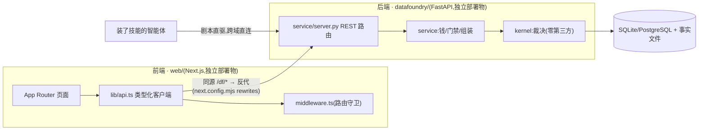

# 30 · 前后端架构(传统两端视角,2026-08-15,委托人「按照传统的前后端来」指令)

docs/28/29 是**领域视角**(技能×平台×领域三支柱)。本文是**工程视角**——拿这套系统
给任何一个传统 Web 团队看,前端是谁、后端是谁、契约是什么、怎么部署、怎么联调。
两份文档不冲突:领域视角回答"为什么这样设计",本文回答"具体怎么接、怎么跑"。

## 1. 两端总览



**两个独立部署物,一份 REST 契约,零私有协议。** 前端不是后端的模板引擎,后端不
为前端定制任何专属端点——智能体与浏览器读写的是**同一套 API**(窄腰律,docs/21 律二)。

## 2. 后端:纯 API 服务

- **只对外说 REST + JSON**,例外三处历史遗留极简 HTML(落地页 `/`、设备码授权页
  `/device`、旧只读控制台 `/console/*`)——均为**内核兜底页**,零 JS、零构建链,
  前端下线也能完成登录闭环(docs/29 §3.5「内核兜底页纪律」);其中 `/console/*` 与
  前端的 `web/app/console/page.tsx` **同名不同宿主**(不同域名,技术上零冲突)——
  旧控制台留作兜底,新看板是正式产品面,前端页面覆盖的用例齐全后旧路由按 docs/28
  30-A 计划退役(先共存,不抢先删)
- 内部分层(kernel/service/interface)已有专篇,本文不重复:docs/21 律 / docs/27 T1-T6
- **前端可见的契约面** = FastAPI 自动生成的 OpenAPI(`/openapi.json`,`/docs` 交互文档)——
  这是前后端联调的唯一权威来源,不另写手工契约文档(手写会漂移,生成的不会)
- CORS:后端不对任意源开放 CORS——前端走同源反代(§4),不需要 CORS;
  第三方直连(技能剧本)天然跨域但走 Header 认证(`X-API-Key`),不受 CORS 约束(非浏览器请求)

## 3. 前端:`web/` 内部架构(本轮补齐,此前只有页面没有分层)

传统前端三层,现已落地:

```
web/
├── app/                       # 路由层(Next.js App Router = 传统 MVC 的 View+Controller)
│   ├── layout.tsx / page.tsx / globals.css / not-found.tsx
│   ├── login/
│   │   ├── page.tsx           #   登录页(✅,30-A)
│   │   └── actions.ts         #   Server Action:口令只经浏览器→Next 服务端→后端,零客户端 JS 落地
│   └── console/                #   30-B 四页投影全部落地 ✅(浏览器实测)
│       ├── page.tsx            #     总览:余额+最近运行+订单
│       ├── runs/[id]/page.tsx  #     Run 详情:死因分布+人话+抽检+下载
│       ├── datasets/page.tsx   #     数据集列表(只读,上传仍在技能剧本侧)
│       └── recipes/            #     配方索引 + [name]/history(留存/成本/评测/hash 演化)
├── components/                # 展示层(✅):无状态 UI 原件,props 进类型出
│   ├── Card.tsx / StatChip.tsx / DeathBar.tsx / KillSample.tsx
├── lib/
│   ├── api.ts                 # 客户端数据层:类型化 REST 客户端(Client Component 用,走 /df 反代)
│   ├── api-server.ts          # 服务端数据层:Server Component 用,cookie→Bearer 转发,直连后端;
│   │                          #   apiServerStatus 额外带状态码(区分 401 未认证 / 404 资源不存在)
│   ├── types.ts                # 契约层(✅):镜像后端 Pydantic/store 响应形状
│   ├── death.ts                 # 死因聚合(✅):按 trace 末步算子计数,抽样/全量denom 由调用方定
│   └── gloss.ts                # 领域语言层:死因人话对照(与 console.py GLOSS 同源同词)
└── middleware.ts               # 路由守卫:cookie 在场性预检(真伪仍归后端裁决)
```

- **两条数据获取路径,场景各有分工**:Server Component(总览页等纯读页)经
  `lib/api-server.ts`——读 `df_session` cookie,**转发为 `Authorization: Bearer`** 直连后端
  (SSR 没有浏览器帮你带同源 cookie,反代规则也只拦浏览器发起的请求);Client Component
  (未来的表单/轮询叶子)经 `lib/api.ts`——浏览器 `fetch('/df/...')`,cookie 由浏览器自动
  同源带上。两条路径落地同一份后端判定逻辑(`current_user`,§3.1 已改)。
- **组件不拿 fetch**:所有数据获取经上述两层客户端之一,组件只吃 props——传统
  "容器/展示"分离,写测试与换后端字段时改动面收敛到一处
- **类型不臆造**:`lib/types.ts` 手镜像后端响应形状(§5 给出当前全集);字段改名两端
  同 PR 修改,`tests/test_domains.py` 之外新增前端契约核对留待后续(见 §7 债务)
- **Server Component 默认,Client Component 显式声明**:只有需要浏览器状态(表单/轮询)
  的叶子组件标 `"use client"`——多数看板页是纯读,天然适合服务端渲染;登录页用
  Server Action 而非 `"use client"` 表单,口令连一次 `fetch` 响应体都不必经过页面 JS

### 3.1 认证桥修复(本轮落地,不是既有事实)

设计初版有一个洞:通用 REST(`/billing/me`、`/runs`…)的 `current_user` 只认
`X-API-Key`/`Authorization: Bearer` 两种 header,**不认 `df_session` cookie**——只有
`console.py` 的手写 `console_user` 认。这意味着"前端经 `/df/*` 同源反代拿 cookie 就能
调通用 API"这句话在补丁前是假的。已修:`security.py` 新增
`user_from_session_cookie(secret, cookie_value)`(与 Bearer 共用 `parse_token`,同一签发源,
只是载体不同),`current_user` 与 `console_user` 现在调用同一份判定,消除重复实现。
验证:`tests/test_web_login.py::test_session_cookie_authenticates_general_rest`
(cookie 认证 `/datasets` 200;无 cookie 401;伪造 cookie 401)。

## 4. 通信契约:同源反代(BFF-lite),不是裸跨域

```
浏览器 → https://dashboard.example/df/billing/me
              │  (Next.js rewrites, next.config.mjs)
              ▼
       https://api.example/billing/me   (真实后端)
```

**为什么不是"前端直连后端 API + CORS"这种更常见的裸跨域模式**:

| 维度 | 同源反代(现选) | 裸跨域 + CORS |
|---|---|---|
| 会话 cookie | 落前端域,`HttpOnly+SameSite=Lax` 直接生效 | 需 `SameSite=None`+`Secure`,三方 cookie 政策下多浏览器降级拦截 |
| 免密直登复用 | `/auth/web` 既有端点**零改动**直接工作(令牌→303→本域 Set-Cookie) | 需重新设计跨域会话桥 |
| CSRF 面 | 单域,标准 CSRF token 即可 | 需额外出站信任配置 |
| 部署耦合 | 前端需知道后端地址(一个环境变量) | 相同,外加 CORS allowlist 需与前端域同步维护 |

**代价**:前端必须是有服务端运行时的部署形态(Node/Edge),不能纯静态导出到 CDN——
这是**已知取舍**,记入 §6 重估触发。

## 5. API 契约面(前端消费的子集,当前全集;来源 = 后端 OpenAPI)

| 端点 | 方法 | 前端用途 | 响应形状(`lib/types.ts`) | 状态 |
|---|---|---|---|---|
| `/auth/login` | POST | 登录页表单(Server Action) | `{ token, role }` | ✅ 已接线 |
| `/auth/me` | GET | 会话自检 | `User` | 待接(30-C 授权中心) |
| `/auth/register` | POST | 注册页表单 | `{ username, role, next }` | 待接(30-D 公开区) |
| `/auth/web` | GET | 免密直登落地(302 由后端处理,前端仅跳转) | — | ✅ 反代零改动直接工作 |
| `/billing/me` | GET | 账务页余额+流水;总览页余额卡 | `{ balance, orders: Order[] }` | ✅ 总览已接 |
| `/billing/plans` | GET | 定价页 | `Record<string, Plan>` | 待接(30-D) |
| `/billing/orders` | POST | 建单 | `{ order: Order, payment: PaymentIntent }` | 待接(30-C) |
| `/datasets` | GET | 数据集列表页 | `Dataset[]` | ✅ 已接线,浏览器实测 |
| `/runs` | GET | 总览最近运行 | `RunSummary[]` | ✅ 已接线 |
| `/runs/{id}` | GET | Run 详情页 | `Run`(含 `manifest`) | ✅ 已接线,浏览器实测 |
| `/runs/{id}/rejects` | GET | 死因分布/样例(`n=100` 上限,§7 债务) | `{ rejects: RejectSample[] }` | ✅ 已接线,浏览器实测 |
| `/runs/{id}/output` | GET | 下载交付(`<a href>` 直接跳转,非 JSON,非 fetch) | — | ✅ 已接线 |
| `/recipes` | GET | 配方索引页 | `RecipeSummary[]` | ✅ 已接线,浏览器实测 |
| `/recipes/{name}/history` | GET | 配方档案页(留存/成本/评测/hash 演化) | `RecipeHistory`(`{ recipe, current_hash, runs }`) | ✅ 已接线,浏览器实测(含空档案诚实态) |

前端**不消费**、也不应出现在任何前端代码里的端点:`/users`(管理面)、
`/billing/grant`(管理面)、`/billing/webhook`(服务器间回调)——三者只走
REST/CLI,与 docs/23 §4「管理面永不进 toC」裁定同口径。

## 6. 部署与联调

- **两个独立 CI/CD 管线**:`tests.yml`(后端,双后端矩阵)+ `web-build.yml`(前端,
  `next build` 验证);互不阻塞,一个仓库两条生产线
- **环境变量契约**:前端仅需 `DF_API_BASE`(后端地址);后端对前端零感知
  (不存在"前端专属 env"这种耦合)
- **本地联调**:`datafoundry serve --home <dir>` 起后端 + `next dev` 起前端,
  `DF_API_BASE=http://127.0.0.1:<port>` 反代到本地后端;无需 mock,契约就是真实后端
  (30-B 验收即用此法:注册→上传→跑真管线→Playwright 走真实登录表单→截图核对
  Run 详情页死因分布/GLOSS/抽检/下载/404,双主题各一遍——见 §7 「未提交为可复跑测试」)
- **版本对齐**:同仓库同分支同 commit——前后端天然同版本;若未来分仓/分速率发布,
  契约稳定性依赖窄腰律(docs/21 律二④)与 OpenAPI diff 检查(债务,见下)

## 7. 已知债务(登记,不是遗漏)

| 债务 | 现状 | 触发 |
|---|---|---|
| 前端类型手镜像,非生成 | `lib/types.ts` 手写 | 端点数超过手工同步舒适区 → 引入 openapi-typescript 生成 |
| 无契约破坏性检查 | 后端改字段不会让前端 CI 红 | 契约事故发生一次 → CI 加 OpenAPI schema diff 门禁 |
| 未提交为可复跑测试 | 30-B 验收靠本地起真后端+Playwright 手动跑(§6),结论真实但不进 CI、不可重放 | 组件数超过一屏 → 固化为 `web-build.yml` 里的 Playwright E2E 步骤,复用「看板走查」思路 |
| Run 详情死因占比可能是抽样 | `/runs/{id}/rejects` 硬顶 `n≤100`;`killed>100` 时页面按抽样基数算百分比并在标题标注,但那是**文件里前 N 条**而非随机样本,可能有偏 | 出现大批量运行(killed>100)实例时验证标注是否清晰;长期修法 = 加 `/runs/{id}/death-summary` 聚合端点(服务端算全量,前端只拿结果) |
| 静态导出不可用 | 反代要求 Node/Edge 运行时 | 需要纯 CDN 分发时重估(§4 代价) |

## 8. 与既有正典的关系

- 不改变 docs/28(看板产品设计)、docs/29(通用脚手架三支柱)的任何裁定——本文是
  两者在"前后端联调"这一具体问题上的补充切面
- `web/README.md` 的四条架构约定与本文 §2-4 同口径,细节以 README 为准(更贴代码)
- 下次改动 REST 端点形状,**先改 §5 表,再动代码**——表和代码不符视为缺陷
  (docs/25 §9 纪律的延伸)
